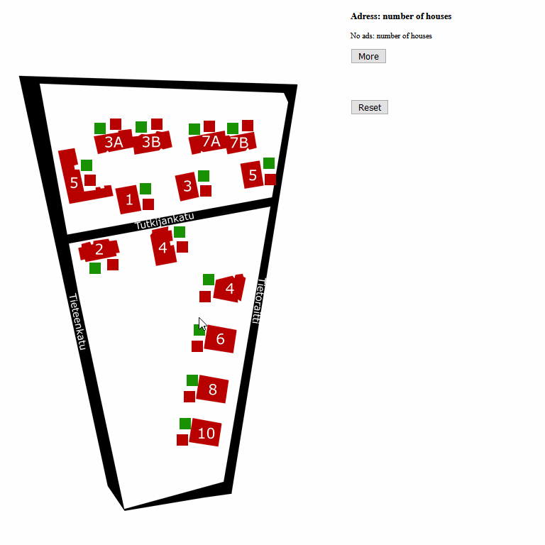

# delivery-app

Single page with a map. Every building starts with the colour red and is a click away from being highlighted in green to be marked as finished.

The combination of red and green is maintained even if the page is refreshed. Reset button changes everything to the red state again. 

A list of buildings and information about them is also available, and it's possible to open a more detailed panel in one click.

